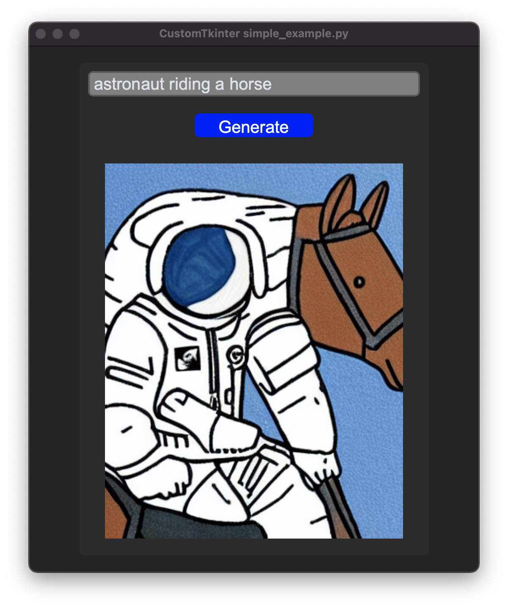

# StableDiffusionApp
Simple application to generate images with the Keras text-to-image Stable Diffusion model.
See also availabe reference guide at: 
https://keras.io/guides/keras_cv/generate_images_with_stable_diffusion/
# -------------------------
## Setting up the environment
Setting up conda environment with the right dependencies:

$ `git clone https://github.com/arterom/StableDiffusionApp.git`

$ `cd StableDiffusionApp`

$ `conda env create -f conda_environment.yml`

$ `conda activate stable_diff`

# -------------------------

## Quickstart GUI

$ `python GUI.py`

# -------------------------

## Quickstart Node App (2x terminals)

# API

$ `cd api`

$ `uvicorn api:app --reload`

# Webserver

$ `cd client`

$ `npm install`

$ `npm start`

# -------------------------